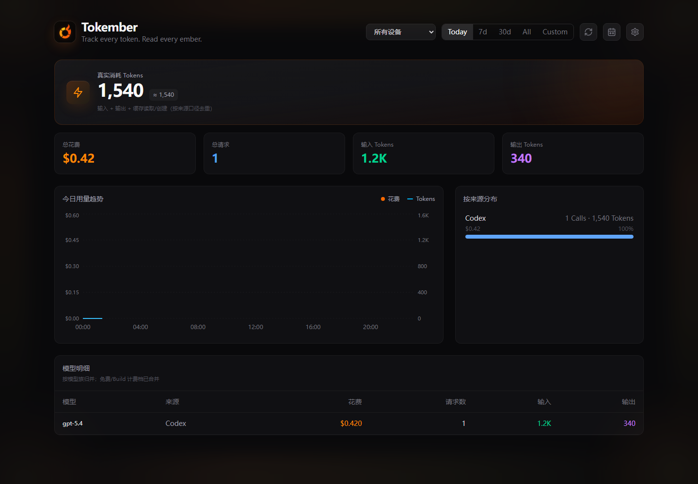

# Tokember

<p align="center">
  
</p>

<p align="center"><strong>Track every token. Read every ember.</strong></p>

Self-hosted dashboard for **multi-device AI agent token usage and cost**.
Collectors on each machine read **local** tool data and push aggregates to a
small **Hono + SQLite** API. The web UI shows spend, tokens, models, devices,
and a year heatmap; Admin manages pricing, devices, and audit.

**License:** [MIT](./LICENSE) ·
**Contributing:** [CONTRIBUTING.md](./CONTRIBUTING.md) ·
**Security:** [SECURITY.md](./SECURITY.md) ·
**Support:** [SUPPORT.md](./SUPPORT.md)

| Doc | Topic |
|-----|--------|
| [docs/privacy.md](./docs/privacy.md) | What is / isn’t uploaded |
| [docs/COMPATIBILITY.md](./docs/COMPATIBILITY.md) | OS, runtime, tool matrix |
| [docs/data-lifecycle.md](./docs/data-lifecycle.md) | Retention, export, protocol, upgrades |
| [docs/release.md](./docs/release.md) | Packaging & GitHub Releases |
| [docs/faq.md](./docs/faq.md) | Common issues |



_Generated from the current build with `npm run demo:screenshot` and non-personal demo data._

---

## Why Tokember

- **Agent activity, not gateway mash-ups** — native Claude Code, Codex, Grok Build, Cursor, and friends; shared billing gateways stay in their own UIs.
- **Your server, your SQLite** — no SaaS required; fail-closed collectors never default to someone else’s host.
- **Honest support matrix** — day-0 tools listed below; everything else is Not yet / Roadmap.
- **Ops-ready** — device tokens, collector health, pricing rules, backups, multi-arch images.

```
  ┌─────────────┐   local logs/DBs    ┌────────────┐   HTTPS    ┌──────────────────┐
  │ Claude/Codex│ ─────────────────► │ Collector  │ ─────────► │ Tokember Server  │
  │ Grok/Cursor │                     │ (per host) │            │ + SQLite + Web   │
  └─────────────┘                     └────────────┘            └──────────────────┘
```

---

## Support matrix (day-0)

| Source | Status | Notes |
|--------|--------|--------|
| Claude Code | Supported | Native JSONL |
| Codex | Supported | Native sessions |
| Grok Build | Supported | `turn_completed` usage |
| Cursor | Supported | Local DB |
| Gemini CLI | Supported | When installed |
| Cline | Supported | VS Code globalStorage |
| Roo Code | Supported | VS Code globalStorage |
| Antigravity | Supported | SQLite / RPC |
| Hermes | Supported | Python companion collector |
| OpenClaw | Supported | Local SQLite + legacy JSONL; host-only |
| Pi Agent | Supported | `~/.pi/agent/sessions` |
| Oh My Pi | Supported | Same shape under `~/.omp` |
| GitHub Copilot | **Not yet** | Roadmap |
| Windsurf | **Not yet** | Roadmap |
| OpenCode | **Not yet** | Roadmap |
| Sub2API / shared gateways | **Out of scope** for activity totals | Use gateway billing UI |

Full OS / Node matrix: [docs/COMPATIBILITY.md](./docs/COMPATIBILITY.md).

---

## Privacy (summary)

| Uploaded | Never uploaded |
|----------|----------------|
| Token/cost counters, model, timestamps | Prompts, code, completions |
| Device id/name you set | Absolute paths, usernames, repo URLs |
| Optional HMAC attribution hashes | AI vendor API keys, full transcripts |

Collectors **require** you to set `TOKEMBER_SERVER` and a credential. There is
**no** production URL default in public builds.

Details: [docs/privacy.md](./docs/privacy.md).

---

## Requirements

- **Node.js ≥ 22**
- Optional: **Python 3.12+** (Hermes only)
- Optional: **Docker** (Compose path below)

---

## 5-minute local experience

### 1. Server + web (dev)

```bash
git clone <this-repo> tokember && cd tokember
npm ci
cp .env.example .env
# edit .env — for local try, defaults work with open writes + admin password "development"
# for anything shared: set TOKEMBER_API_KEY and TOKEMBER_ADMIN_PASSWORD

npm run dev:server   # terminal 1 → http://127.0.0.1:3147
npm run dev:web      # terminal 2 → Vite (proxies API)
```

Open the web app, then Admin → `#/settings` (password from env / `development` in pure local mode).

### 2. Collector (same machine)

```bash
# Option A — from repo (after npm ci)
export TOKEMBER_SERVER=http://127.0.0.1:3147          # Windows: set in collector.env
export TOKEMBER_API_KEY=...                           # or device token from Admin
npm run build -w collector
npm run collect                                       # one-shot
# or scheduled:
npm run collector:install -- --schedule adaptive
npm run collector:doctor
# optional allowlist-only support report; never uploaded automatically
node collector/install.mjs diagnose --output tokember-diagnostics.json
```

**Windows note:** prefer editing `collector/collector.env` (created by installer)
instead of exporting secrets in a shared shell history.

```bash
# collector/collector.env (gitignored)
TOKEMBER_SERVER=http://127.0.0.1:3147
TOKEMBER_DEVICE_TOKEN=...    # preferred
# TOKEMBER_API_KEY=...       # legacy shared key during migration
```

### 3. Verify first data

1. Use any supported tool (e.g. finish a Grok Build / Claude turn).  
2. `node collector/install.mjs collect` (or wait for the schedule).  
3. Dashboard should show new calls; Admin → **Devices & Collectors** should show
   a successful source (e.g. `grok-build`) and device health.

Health probes (no secrets):

- `GET /api/health/live`
- `GET /api/health/ready`

---

## Production: Docker Compose

```bash
cp .env.example .env
# set strong TOKEMBER_API_KEY + TOKEMBER_ADMIN_PASSWORD

export TOKEMBER_COMMIT="$(git rev-parse HEAD)"
export TOKEMBER_BUILT_AT="$(git show -s --format=%cI HEAD)"

docker compose up -d --build
# API + UI: http://127.0.0.1:3147  (bind is localhost by default)
```

Compose requires build args `TOKEMBER_COMMIT` and `TOKEMBER_BUILT_AT` for
reproducible `release.json` identity. Multi-arch images and GitHub Releases:
[docs/release.md](./docs/release.md).

> **Private monorepo note:** some maintainers use a separate host-deploy
> workflow for their own servers. That path is **not** required for public
> self-hosting via Compose or your own systemd unit.

---

## Install Collectors on three OSes

Unified entry (repo or release pack):

```bash
node collector/install.mjs install     # or: upgrade | uninstall | doctor | collect | dry-run
# npm run collector:install
# npm run collector:doctor
```

| OS | Scheduler | Notes |
|----|-----------|--------|
| Windows 10+ | Task Scheduler `tokember-collector` | Env file ACL’d to user/SYSTEM/Administrators |
| macOS 12+ | launchd user agent | Per-user agent |
| Linux | systemd **user** timer | Enable linger if you need runs after logout |

- Default schedule mode: **adaptive** (1-minute OS tick + local admission).  
- Rollback: `--schedule fixed` (30-minute fixed interval).  
- Upgrade keeps `collector.env` and `~/.tokember` / legacy `~/.ai-burn` state.  
- `uninstall --purge` removes env/log only when you ask.
- `diagnose --output <file>` writes an anonymous allowlist JSON locally; add
  `--overwrite` only when replacing an existing report intentionally.

Release tarball/zip: extract → `node install.mjs install` (see
[docs/release.md](./docs/release.md)).

### Device token flow (recommended)

1. Deploy Server with Admin access.  
2. Admin → **Devices & Collectors** → create / issue **device token**.  
3. Put `TOKEMBER_DEVICE_TOKEN=...` in the host’s protected `collector.env`.  
4. Set `TOKEMBER_SERVER=https://your-host.example` (never commit this).  
5. `doctor` + `collect`; confirm Admin health.  
6. After all devices use tokens, set `TOKEMBER_ALLOW_LEGACY_API_KEY=false` and
   retire the shared key.

---

## Packages

| Package | Role |
|---------|------|
| `contracts` | Shared API / wire types |
| `server` | Hono API, SQLite, pricing, admin auth |
| `web` | React dashboard + settings (Vite, Tailwind, Recharts) |
| `collector` | Native TS collector + Hermes Python companion |

```bash
npm run verify   # typecheck, tests, builds, collector dist smoke, release contracts
```

---

## Configuration reference

Full template: [`.env.example`](./.env.example).

| Variable | Who | Purpose |
|----------|-----|---------|
| `TOKEMBER_API_KEY` | Server + legacy collectors | Shared write key (migration) |
| `TOKEMBER_ADMIN_PASSWORD` | Server | Admin console |
| `TOKEMBER_DEVICE_TOKEN` | Collector | Preferred per-device credential |
| `TOKEMBER_SERVER` | Collector | API base URL (**required**, no public default) |
| `TOKEMBER_CORS_ORIGINS` | Server | Extra exact browser origins |
| `TOKEMBER_ALLOW_LEGACY_API_KEY` | Server | `true` during token rollout |
| `TOKEMBER_SCHEDULE_MODE` | Collector | `adaptive` \| `fixed` |
| `TOKEMBER_ATTRIBUTION_ENABLED` | Collector | Opt-in hashed project/session |
| `PORT` / `DB_PATH` | Server | Listen port / SQLite path |
| `TOKEMBER_BUILD_METADATA` | Release runtime | Path to verified `release.json` |

Legacy `AI_BURN_*` names remain accepted during migration.

### Pricing resolution

1. Collector-provided cost → `provided`  
2. Enabled **source** pricing rule  
3. Enabled **global** model rule  
4. Else → `unpriced` (reprice after adding rules)

### Network boundary

- Collectors → **only** your `TOKEMBER_SERVER` (register, ingest, run reports).  
- Browser → your Server origin (+ optional exact CORS origins).  
- No third-party analytics baked into the default product path.

---

## Backup, upgrade, uninstall

| Action | How |
|--------|-----|
| Collector upgrade | `node collector/install.mjs upgrade` |
| Collector uninstall | `node collector/install.mjs uninstall` [`--purge`] |
| Server image / tag | Prefer immutable tags; see [docs/release.md](./docs/release.md) |
| SQLite backup | Ops-dependent; Compose volume `./data`; production hosts may use timed Online Backup units |

Dashboard Admin → **System** shows **aggregate** recovery health only (no raw
paths). Manual restore is a deliberate maintenance window, not an automatic
overwrite of the live DB.

---

## Known limitations

- Not a hosted SaaS; you operate the Server and backups.  
- Incomplete tool turns (no completed usage event) are skipped until the next run.  
- Adaptive mode may skip quiet ticks (by design).  
- Gateway / seat-based products (Copilot, etc.) are not day-0 parsers.  
- Attribution is opt-in and hash-based; it is not a full project analytics suite.  

---

## FAQ & support

- [docs/faq.md](./docs/faq.md)  
- [SUPPORT.md](./SUPPORT.md) — issues, no secrets in logs  
- [SECURITY.md](./SECURITY.md) — vulnerability reports  

---

## Admin console (short)

Open `#/settings` after Admin login:

- Usage audit & export  
- Alert center  
- Model pricing & aliases  
- Devices & collectors (per-source health)  
- Data maintenance  
- System information  

---

## Community

- Issues / PRs: use GitHub templates; follow [CONTRIBUTING.md](./CONTRIBUTING.md).  
- Code of conduct: [CODE_OF_CONDUCT.md](./CODE_OF_CONDUCT.md).  
- Changelog: [CHANGELOG.md](./CHANGELOG.md).

Brand name for the public product is **Tokember**. Private forks may keep
internal deploy tooling; public docs use only example hosts such as
`https://tokember.example`.
